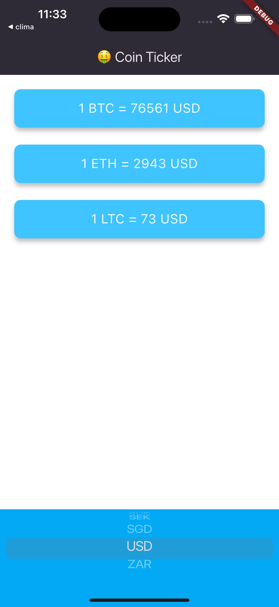

# Crypto Coin Tracker

A Flutter app that displays real-time exchange rates for various cryptocurrencies against fiat currencies. The app integrates with CoinAPI to provide accurate and up-to-date data, offering a simple and intuitive UI for tracking cryptocurrency prices.

## Screenshot

<p align="center">
  <figure style="display: inline-block; margin: 10px;">
    
    <figcaption>Home Screen</figcaption>
  </figure>
</p>

## Features
- **Cryptocurrency Price Display**: Shows exchange rates for cryptocurrencies like BTC, ETH, and LTC in the selected fiat currency.
- **Currency Picker**: Users can select from a list of fiat currencies, and the app updates the prices accordingly.
- **Platform-Specific UI**: Provides an Android-styled dropdown or an iOS-styled Cupertino picker based on the platform.
- **CoinAPI Integration**: Fetches real-time data through CoinAPI.

## Prerequisites

- **Flutter SDK**
- **http Package**: For making network requests.
- **CoinAPI Account**: To get an API key for fetching cryptocurrency data.

## Installation

1. Clone the repository:
   ```bash
   git clone https://github.com/yourusername/crypto_coin_tracker.git
   ```
2. Navigate to the project directory:
   ```bash
   cd crypto_coin_tracker
   ```
3. Install the required dependencies:
   ```bash
   flutter pub get
   ```

4. Set up the API key:
   - Open `price_screen.dart` and replace `'YOUR_API_KEY'` with your actual CoinAPI key.

## Usage

1. **Run the App**:
   ```bash
   flutter run
   ```
2. Once the app is running:
   - View the cryptocurrency prices in the selected fiat currency.
   - Change the fiat currency using the picker at the bottom of the screen to see updated exchange rates.

## Code Overview

- **main.dart**: Sets up the app with a dark theme and loads the `PriceScreen`.
- **CoinData**: Manages API requests to fetch cryptocurrency prices from CoinAPI.
- **PriceScreen**: The main screen that displays the exchange rate and provides a currency picker for selecting the fiat currency.
- **PriceWidget**: Custom widget that displays the exchange rate for a specific cryptocurrency/fiat pair.

## License

This project is licensed under the MIT License.
